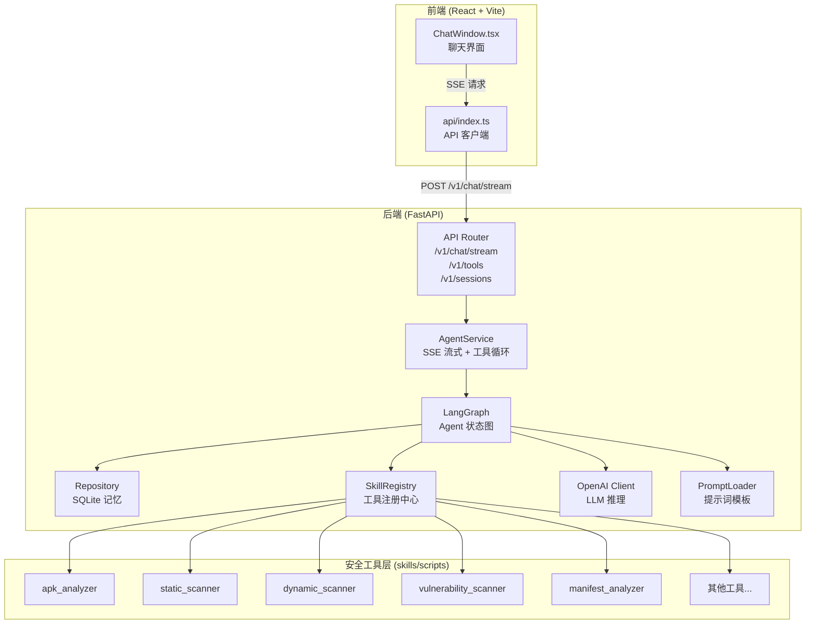
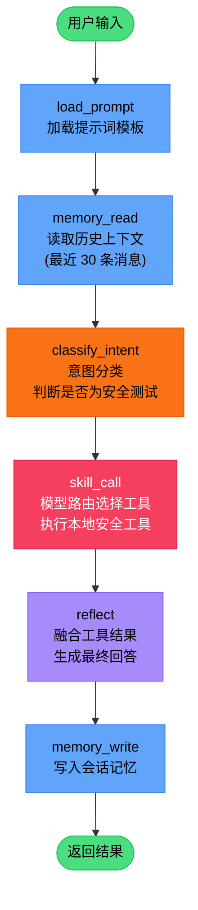
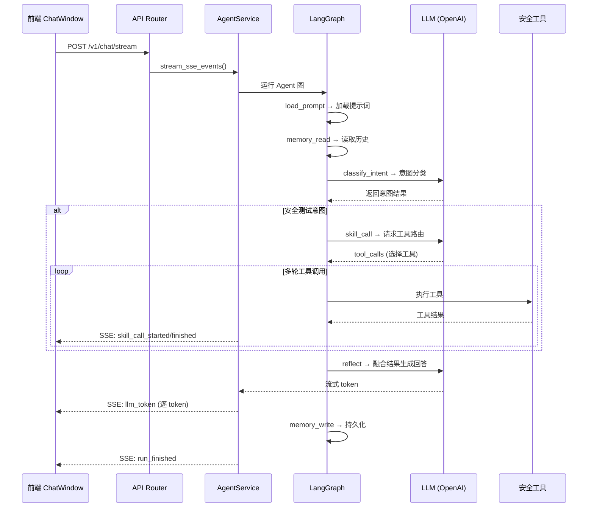

# Security Agent 项目架构分析

## 项目概述

一个**车载安全智能体系统**，基于 LLM 驱动的安全测试工具编排，提供对话式安全检测能力。

| 层级 | 技术栈 | 职责 |
|------|--------|------|
| 前端 | React + Vite + TypeScript + TailwindCSS | 聊天式交互界面 |
| 后端 | FastAPI + LangGraph + SQLite | Agent 编排、工具调度、会话记忆 |
| 工具层 | Python 脚本（10 个安全工具） | APK 分析、漏洞扫描、网络分析等 |

---

## 项目目录结构

```
security_agent/
├── backend/
│   ├── app/
│   │   ├── main.py              # FastAPI 入口
│   │   ├── api/v1/              # REST 接口（chat, sessions, tools）
│   │   ├── graph/               # LangGraph 图编排
│   │   │   ├── builder.py       # 图构建（节点 + 边）
│   │   │   ├── nodes.py         # 6 个节点函数
│   │   │   ├── state.py         # AgentState 定义
│   │   │   └── events.py        # SSE 事件工具
│   │   ├── services/
│   │   │   └── agent_service.py # 核心服务：SSE 流式 + 工具调用循环
│   │   ├── skills/registry.py   # 工具注册中心
│   │   ├── memory/repository.py # SQLite 会话记忆
│   │   ├── prompts/             # 提示词加载 & 渲染
│   │   ├── llm/                 # OpenAI 兼容客户端
│   │   ├── core/config.py       # 配置管理
│   │   └── db/database.py       # SQLite 封装
│   ├── skills/scripts/          # 10 个安全测试工具实现
│   ├── prompts/                 # 提示词模板文件
│   └── config/settings.json     # 运行配置
└── frontend/
    └── src/
        ├── App.tsx              # 根组件
        ├── main.tsx             # 入口
        ├── api/index.ts         # 后端 API 调用
        ├── features/chat/
        │   └── ChatWindow.tsx   # 核心聊天窗口（SSE 消费）
        └── components/layout/   # Header, Sidebar, MainLayout
```

---

## 核心架构流程图

### 1. 整体系统架构



### 2. LangGraph Agent 处理流程



### 3. SSE 流式对话完整链路



### 4. 安全工具清单

| 工具 | 文件 | 功能 |
|------|------|------|
| `apk_analyzer` | [apk_analyzer.py](file:///Users/xiongdejian/project/python_project/security_agent/backend/skills/scripts/apk_analyzer.py) | APK 基本信息、组件、证书分析 |
| `static_scanner` | [static_scanner.py](file:///Users/xiongdejian/project/python_project/security_agent/backend/skills/scripts/static_scanner.py) | 静态代码安全扫描 |
| `dynamic_scanner` | [dynamic_scanner.py](file:///Users/xiongdejian/project/python_project/security_agent/backend/skills/scripts/dynamic_scanner.py) | 动态行为安全扫描 |
| `vulnerability_scanner` | [vulnerability_scanner.py](file:///Users/xiongdejian/project/python_project/security_agent/backend/skills/scripts/vulnerability_scanner.py) | 已知漏洞检测 |
| `manifest_analyzer` | [manifest_analyzer.py](file:///Users/xiongdejian/project/python_project/security_agent/backend/skills/scripts/manifest_analyzer.py) | AndroidManifest 分析 |
| `mobsf_integration` | [mobsf_integration.py](file:///Users/xiongdejian/project/python_project/security_agent/backend/skills/scripts/mobsf_integration.py) | MobSF 集成 |
| `mobsf_static_analyzer` | [mobsf_static_analyzer.py](file:///Users/xiongdejian/project/python_project/security_agent/backend/skills/scripts/mobsf_static_analyzer.py) | MobSF 静态分析 |
| `network_analyzer` | [network_analyzer.py](file:///Users/xiongdejian/project/python_project/security_agent/backend/skills/scripts/network_analyzer.py) | 网络通信安全分析 |
| `permission_checker` | [permission_checker.py](file:///Users/xiongdejian/project/python_project/security_agent/backend/skills/scripts/permission_checker.py) | 权限合规检查 |
| `code_analyzer` | [code_analyzer.py](file:///Users/xiongdejian/project/python_project/security_agent/backend/skills/scripts/code_analyzer.py) | 源码安全分析 |

### 5. 后端关键模块依赖关系

```mermaid
graph LR
    main["main.py<br/>FastAPI App"] --> router["api/v1/<br/>API 路由"]
    main --> service["AgentService<br/>核心服务"]

    service --> graph["LangGraph<br/>图编排"]
    service --> registry["SkillRegistry<br/>工具注册"]
    service --> llm["OpenAI Client"]
    service --> prompt["PromptLoader"]
    service --> repo["Repository"]

    graph --> nodes["nodes.py<br/>6 个节点"]
    nodes --> registry
    nodes --> llm
    nodes --> repo
    nodes --> prompt

    registry --> tools["skills/scripts/<br/>10 个安全工具"]
    repo --> db["Database<br/>SQLite"]

    style main fill:#fbbf24,stroke:#f59e0b,color:#000
    style service fill:#f87171,stroke:#ef4444,color:#000
    style graph fill:#a78bfa,stroke:#8b5cf6,color:#000
    style registry fill:#34d399,stroke:#10b981,color:#000
```

---

## API 接口一览

| 接口 | 方法 | 描述 |
|------|------|------|
| `/v1/chat/stream` | POST | 对话流式接口（SSE） |
| `/v1/tools` | GET | 查询可用工具清单 |
| `/v1/sessions` | GET | 获取历史会话列表 |
| `/v1/sessions/{id}/memory` | GET | 查询会话记忆 |
| `/healthz` | GET | 健康检查 |
| `/summaries/*` | Static | 安全报告静态文件 |
